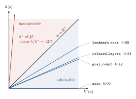
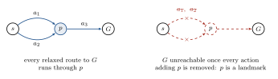
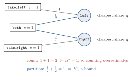
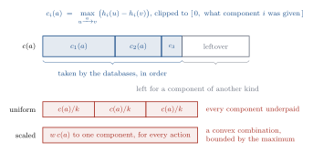
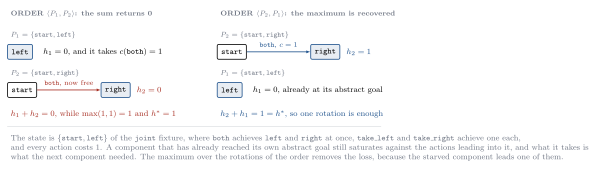

# Automatic Discovery of Planning Heuristics

A research framework for investigating whether effective search heuristics for
classical and epistemic planning can be discovered automatically rather than
designed by hand.

## 1. Motivation

Heuristic search is the dominant paradigm in automated planning, and the
heuristic function is the component that decides whether a planner is usable.
The heuristics in current use (delete relaxation, landmarks, abstractions,
critical paths) are human artefacts: each is the product of a research
programme, each encodes a particular structural insight, and each is fixed once
published. Two consequences follow. Progress is bounded by the rate at which
researchers invent new relaxations, and a heuristic that is excellent on one
domain is frequently mediocre on another, because the insight it encodes is not
the one that domain rewards.

The alternative pursued here is to treat the heuristic itself as the object of
search. Given a planner, a set of state features, and a benchmark suite, an
outer optimisation loop proposes heuristics, measures the search effort they
induce, and uses that measurement to propose better ones. The question this
repository exists to answer is empirical: *how far does that get, and under
which method?*

The intended trajectory is to compare families of discovery methods
(derivative-free optimisation, evolutionary search, reinforcement learning,
program synthesis) on the same benchmark, under the same objective, with the
same execution engine. This requires infrastructure that keeps the discovery
method interchangeable and the measurement trustworthy. That infrastructure is
what the present phase provides; the discovery methods themselves are the
subject of later phases.

A methodological commitment runs through the design: **the discovered heuristic
must remain interpretable**. A weight vector over named features can be read,
compared against known heuristics, and reasoned about. This constrains what can
be discovered, and that is accepted deliberately: a result that cannot be
explained teaches less than a weaker result that can.

## 2. Problem formulation

### 2.1 Planning tasks

A planning task is a tuple

```math
T \;=\; \langle P,\; A,\; s_0,\; G \rangle
```

where $P$ is a finite set of propositions, $A$ a set of actions, $s_0$ the
initial state and $G$ the goal condition. In Phase I tasks are propositional
STRIPS: a state is a subset $s \subseteq P$, and an action

```math
a \;=\; \langle \mathrm{pre}(a),\; \mathrm{add}(a),\; \mathrm{del}(a) \rangle,
\qquad \mathrm{pre}(a),\, \mathrm{add}(a),\, \mathrm{del}(a) \subseteq P,
\qquad c(a) > 0
```

is applicable in $s$ iff $\mathrm{pre}(a) \subseteq s$, in which case it induces
the transition

```math
s' \;=\; \bigl(s \setminus \mathrm{del}(a)\bigr) \,\cup\, \mathrm{add}(a).
```

A state $s$ is a goal state iff $G \subseteq s$. A plan is a sequence
$\pi = \langle a_1, \dots, a_k \rangle$ leading from $s_0$ to a goal state, of
cost $c(\pi) = \sum_{i=1}^{k} c(a_i)$.

### 2.2 The hypothesis class

Let $f_1, \dots, f_n$ with $f_i : S \to \mathbb{R}$ be state features. The
candidate heuristics are their linear combinations,

```math
h_\theta(s) \;=\; \sum_{i=1}^{n} \theta_i \, f_i(s) \;=\; \theta^{\top} f(s),
\qquad \theta \in \mathbb{R}^n .
```

The class is deliberately small. Every element of it is a readable equation over
named quantities, so a discovered $\theta$ can be compared with heuristics that
were designed rather than found.

### 2.3 The objective

Fix a search algorithm $\mathcal{A}$ (greedy best-first search unless stated
otherwise) and a benchmark suite $I = \{T_1, \dots, T_m\}$. Running
$\mathcal{A}$ with $h_\theta$ on $T_j$ yields the measured quantities
$\mathrm{exp}(T_j, \theta)$, $\mathrm{time}(T_j, \theta)$ and
$\mathrm{cost}(T_j, \theta)$ for expansions, runtime and solution cost, together
with an indicator $\mathrm{solved}(T_j, \theta) \in \{0, 1\}$. Heuristic
discovery is the optimisation problem

```math
\theta^{\star} \;=\; \arg\min_{\theta} \; J(\theta),
```

```math
J(\theta) \;=\;
\alpha \, \frac{1}{m}\sum_{j=1}^{m} \frac{\mathrm{exp}(T_j, \theta)}{\mathrm{exp}(T_j, \mathrm{ref})}
\;+\; \beta \, \frac{1}{m}\sum_{j=1}^{m} \frac{\mathrm{time}(T_j, \theta)}{\mathrm{time}(T_j, \mathrm{ref})}
\;+\; \gamma \, \frac{1}{m}\sum_{j=1}^{m} \frac{\mathrm{cost}(T_j, \theta)}{\mathrm{cost}(T_j, \mathrm{ref})}
\;+\; \delta \, \bigl(1 - \mathrm{cov}(\theta)\bigr),
```

```math
\mathrm{cov}(\theta) \;=\; \frac{1}{m} \sum_{j=1}^{m} \mathrm{solved}(T_j, \theta),
```

where $\mathrm{ref}$ is a fixed reference configuration and
$\alpha, \beta, \gamma, \delta$ are configurable. The cost term ranges over
solved instances only, since an unsolved instance has no cost.

Normalising per instance against a fixed reference makes the objective
scale-free, so that $J = 1$ reproduces the reference and $J < 1$ improves on
it, and prevents large instances from dominating the mean. The coverage term prices
failure, which ratios of search effort cannot express: a heuristic that solves
nothing expands few nodes.

### 2.4 Properties of the problem

Two properties matter for what follows. First, $J$ is not differentiable in
$\theta$ and has no useful analytic structure: it is defined by the behaviour of
a search algorithm, so only zeroth-order methods apply. Second, greedy
best-first search orders nodes by $h$ alone, so for any $\lambda > 0$

```math
h_{\lambda\theta}(s) \;=\; \lambda \, h_{\theta}(s)
\qquad\Longrightarrow\qquad
J(\lambda\theta) \;=\; J(\theta),
```

that is, $\theta$ is identified only up to a positive scalar. The weight space
is bounded accordingly, and candidates are compared after normalising
$\lVert \theta \rVert_\infty = 1$.

## 3. Architecture

Two components. The C++20 execution engine implements states, actions, tasks,
the search algorithms (breadth-first, greedy best-first, A\*), the feature
evaluators and the heuristics. It reads a task file and a heuristic
specification, runs the search, and writes a JSON metrics document; it performs
no learning and holds no experiment state. The Python research layer holds
everything outside the search loop: candidate representation, the objective,
the optimisers, benchmark suites, experiment records and reporting. It treats
the engine as a black box invoked once per candidate evaluation.

The interface is one heuristic specification string in and one JSON document
out. Nothing else crosses, and that is what keeps the measurement honest. If
Python were callable from inside the search loop, per-expansion overhead would
depend on the interpreter and expansions would no longer be comparable across
candidates. As it is, the boundary is crossed twice per evaluation, once to
specify the heuristic and once to return the metrics, so reported search effort
is a property of the heuristic rather than of the harness.

The same concern shapes the engine. Heuristics and domains reach the search
algorithms through C++20 concepts rather than virtual interfaces, so evaluation
is inlined and nothing is dispatched per node; a state is a fixed-capacity
bitset, trivially copyable and allocation-free; and an expensive feature is
evaluated only when its weight is non-zero.

## 4. Phase I scope

Phase I establishes the infrastructure and the baseline result. It provides:

- a propositional STRIPS engine with breadth-first search, greedy best-first
  search, and A\*;
- seven interpretable state features and five baseline heuristics (zero, goal
  count, delete-relaxed layers, the landmark bound of §6.1 and the pattern
  databases of §6.2);
- a Blocksworld benchmark generator and a fixed 20-instance suite;
- structured JSON metrics for every planner execution;
- an exact-`h*` oracle and an admissibility verifier for instances small
  enough to enumerate;
- a Python research layer with the objective, three derivative-free optimisers
  (random search, randomised local search, exhaustive grid), and reproducible
  experiment records;
- unit tests for every component and an integration test covering the full
  Python → C++ → JSON → Python loop.

It deliberately excludes reinforcement learning, neural function approximation,
and program synthesis. Those are the subject of the next phase, and admitting
them before the measurement infrastructure is trustworthy would make their
results uninterpretable. The derivative-free optimisers included here are weak
by design: they are the baseline any learned method must beat before it can
claim to have discovered anything.

### 4.1 Features

Write $s^{+}$ for the set of propositions reachable from $s$ in the delete
relaxation, and $\ell(p, s)$ for the layer of the relaxed planning graph at
which $p$ first appears.

| Feature | Definition |
| --- | --- |
| `unsatisfied_goals` | $\lvert G \setminus s \rvert$ |
| `achieved_goals` | $\lvert G \cap s \rvert$ |
| `applicable_actions` | $\lvert \{\, a \in A : \mathrm{pre}(a) \subseteq s \,\} \rvert$ |
| `true_propositions` | $\lvert s \rvert$ |
| `relaxed_layers` | $\max_{p \in G} \ell(p, s)$, an $h_{\max}$-like distance |
| `relaxed_sum` | $\sum_{p \in G} \ell(p, s)$, an $h_{\mathrm{add}}$-like distance |
| `landmark_cost` | uniform cost partition over the landmarks of $s$ (§6.1) |

A goal proposition $p \notin s^{+}$ is unreachable even under the relaxation, so
$s$ is a proven dead end; such a $p$ contributes a large finite constant, which
keeps every heuristic total and comparable without saturating the arithmetic.

### 4.2 Baselines

| Heuristic | Definition |
| --- | --- |
| `zero` | $h(s) = 0$; reduces A\* to uniform-cost search, the control condition |
| `goal_count` | $h(s) = \lvert G \setminus s \rvert$ |
| `relaxed_layers` | $h(s) = \max_{p \in G} \ell(p, s)$; domain-independent and admissible |
| `landmark_cost` | the landmark bound of §6.1; admissible, and the strongest baseline here |
| `pdb` | the maximum over the pattern databases of §6.2; admissible and consistent |

These are the reference points against which discovered heuristics are reported.

## 5. Phase I results

The committed suite holds $m = 20$ Blocksworld instances of five sizes, five to
nine blocks, generated from a fixed base seed. Under greedy best-first search
with a budget of $2 \times 10^{5}$ expansions per instance, the baselines
perform as follows. This section predates `landmark_cost`, and both the table
and the optimisation below range over the six features that existed then; the
search space is now seven-dimensional.

| Heuristic | Solved | Expanded | Generated | Cost | Time |
| --- | ---: | ---: | ---: | ---: | ---: |
| `zero` | 15/20 | 1476582 | 2586793 | 160 | 1.72 s |
| `goal_count` | 20/20 | 2602 | 7579 | 334 | 0.00 s |
| `relaxed_layers` | 20/20 | 19720 | 79271 | 262 | 0.24 s |

Taking `goal_count` as the reference configuration and minimising $J$ with
$\alpha = 1$, $\beta = \gamma = 0$, $\delta = 10$ (that is, scoring expansions
alone under a coverage penalty), random search followed by local refinement
returns, after 25 planner invocations,

```math
h_{\theta^{\star}}(s) \;=\;
2.34\, f_{\mathrm{unsat}}(s) \;+\; 3.62\, f_{\mathrm{ach}}(s) \;+\; 2.73\, f_{\mathrm{app}}(s)
\;+\; 3.72\, f_{\mathrm{true}}(s) \;+\; 3.43\, f_{\mathrm{layers}}(s) \;+\; 3.96\, f_{\mathrm{sum}}(s).
```

Every fourth instance was held out from the optimiser and scored separately.

| Split | Instances | Baseline expanded | Discovered expanded | Reduction |
| --- | ---: | ---: | ---: | ---: |
| Training | 15 | 1838 | 465 | 74.7 % |
| Held out | 5 | 764 | 112 | 85.3 % |

Coverage remained complete on both splits and solution cost did not regress
(280 against 278 on the training split), although the objective did not reward
plan quality.

The reduction should be read narrowly: it is one domain, one search algorithm,
one optimiser seed, and an objective weighting expansions only. What it
establishes is that the loop closes and that $J$ is optimisable at all, which is
what Phase I set out to show. The improvement on held-out instances indicates
that the fitted weights are not purely an artefact of the instances the
optimiser observed, but a single split of five instances supports nothing
stronger than that.

## 6. Admissibility

Section 5 says nothing about admissibility, and no search run can. A heuristic
that overestimates still returns plans, often quickly; A\* simply returns
suboptimal ones and reports nothing unusual. The property is a statement about
`h*`, which on instances small enough to enumerate is computable exactly:
expand every reachable state, then run a backward Dijkstra from the goal states
over the reversed transition relation. `hd_verify` does this and checks each
heuristic against the result.

```
hd_verify --instance instances/blocksworld/blocks-05-00.task \
          --heuristic goal_count --heuristic relaxed_layers
python -m hd.experiments.verify_admissibility --max-states 1000000
```

Three properties are reported per instance: admissibility (`h(s) <= h*(s)` at
every reachable state), consistency (`h(u) <= c(u,v) + h(v)` across every
transition, which is what lets A\* close a state on first expansion), and
informedness, the mean `h/h*` over states with a finite non-zero goal distance.
Among admissible candidates informedness is the quantity that predicts A\*
expansions, and unlike expansions it is dense, deterministic, and obtained
without running a search.

<p align="center">
  
</p>

**Figure 1.** Where a heuristic is allowed to lie. Admissibility confines it to
the region below $h = h^{*}$, and informedness measures how close to that
boundary it gets. Each ray has the gradient of one heuristic's mean $h/h^{*}$
over the twelve instances of the table below; `zero` is the horizontal axis
itself. The $\theta^{\star}$ of §5 leaves the region immediately.

Enumeration reaches eight blocks: at a ceiling of $10^6$ states, 16 of the 20
committed instances are enumerable, 695417 states for the largest, and the
three cheap baselines are checked over all of them in about 22 seconds. The
table below uses the twelve instances up to seven blocks, where every heuristic
including the expensive one is checked on the same 295648 states (42 seconds).

| Heuristic | Verdict | Violations | Informedness |
| --- | --- | ---: | ---: |
| `zero` | admissible, consistent | 0 | 0.000 |
| `goal_count` | admissible, consistent | 0 | 0.419 |
| `relaxed_layers` | admissible, consistent | 0 | 0.442 |
| `landmark_cost` | admissible, inconsistent | 0 | 0.601 |
| `pdb` | admissible, consistent | 0 | 0.488 |
| $\theta^{\star}$ of §5 | inadmissible | 3077314 | 12.657 |

The row for $\theta^{\star}$ is measured over the 16 enumerable instances: it
overestimates at every one of the 3077314 reachable states it was checked on,
by up to 289.29, and values the goal state itself at 59.77 rather than 0. The
optimiser is not at fault. Greedy best-first search orders nodes by `h` alone,
so the objective of §2.3 cannot see admissibility, and §2.4 identifies `θ` only
up to a positive scalar, which admissibility is not invariant to. §5 is a
satisficing result and was never anything else.

The verdicts are not symmetric. A violation is a certificate: the witness state
settles the question for good. A clean report says only that no counterexample
was found among the instances that could be enumerated, and is reported as
*not falsified* rather than as proof. Enumeration is also exponential in
instance size, so the check is available exactly where search is easy. A
hypothesis class whose members are admissible *by construction* is therefore
worth more than one that has to be tested.

The present class is not such a class. Admissibility forces `h` to vanish on
goal states, where `achieved_goals`, `true_propositions` and
`applicable_actions` are all non-zero, so three of the seven weights must be
zero before anything else is considered. The sum of two admissible heuristics
is in general not admissible either, which leaves little inside `h_θ` to
discover. §6.4 says what an admissible class needs and §6.5 builds one: under a
cost partition the sum of the components is admissible by construction, so the
verifier checks the construction instead of filtering candidates.

### 6.1 The landmark component

A landmark of a state $s$ is a proposition true at some point in every plan
from $s$. Landmarks are generated here by relaxed reachability: $p$ is a
landmark iff the goal is unreachable in the delete relaxation from $s$ once
every action adding $p$ is removed. The test is sound, because every real plan is
also a relaxed plan, so a fact that all relaxed plans need is a fact that all
plans need. It is incomplete in two ways, both of which cost informedness and
neither of which costs admissibility: it finds only single-fact landmarks, and
it misses those whose necessity depends on delete effects.

<p align="center">
  
</p>

**Figure 2.** The test that generates a landmark. Both panels are in the delete
relaxation, where reachability is monotone and cheap to decide, so one fixpoint
per candidate proposition answers the question.

*Counting* the unachieved landmarks is not admissible, because one action may
achieve several at once. The value used is the uniform cost partition over
landmarks (Karpas and Domshlak, 2009): each action divides its cost equally
among the landmarks it can achieve, and each landmark contributes the cheapest
share any of its achievers assigns it,

```math
h_{\mathrm{LM}}(s) \;=\; \sum_{L \,\in\, \mathrm{LM}(s)} \;
\min_{a \,:\, L \in \mathrm{add}(a)}
\frac{c(a)}{\lvert \mathrm{add}(a) \cap \mathrm{LM}(s) \rvert}.
```

Every plan achieves every landmark, and the shares one action hands out sum to
at most its own cost, so the total is a lower bound.

<p align="center">
  
</p>

**Figure 3.** The case that separates the two, and the task the unit tests use.
`both` achieves the two goals at once, and each goal also has a single-goal
achiever of its own. Counting the unachieved landmarks returns 2 against an
optimal cost of 1, and the verifier falsifies it; dividing the cost of `both`
between the landmarks it achieves returns exactly 1.

Landmarks are regenerated from scratch at every state, because the framework
requires $h$ to be a function of the state alone, and that costs one relaxed
reachability test per candidate proposition. Making the component competitive
in runtime is a separate problem from making it admissible, and it is not
solved here.

The verifier denies the component one property: `landmark_cost` is admissible
but *not consistent*. Landmark sets generated from the state do not vary
monotonically along a transition, so $h$ can fall by more than the cost of an
edge, and A\* loses the guarantee that a state is closed on first expansion.
The search is still correct.

### 6.2 The pattern database component

A pattern is a subset $P$ of the propositions. Projecting the task onto $P$
keeps only the part of every state, precondition and effect that lies inside
it:

```math
\mathrm{proj}(s) = s \cap P, \qquad
\mathrm{proj}(a) = \langle\, \mathrm{pre}(a) \cap P,\;
\mathrm{add}(a) \cap P,\; \mathrm{del}(a) \cap P \,\rangle .
```

The projection is a homomorphism, because intersection distributes over the
STRIPS transition, and a projected precondition is weaker than the concrete
one. Every concrete plan therefore maps to an abstract plan of the same cost,
the abstract goal distance is at most the concrete one, and reading it off is
admissible. It is also consistent, which no argument about landmarks can give.

The table is the exact goal distance of every abstract state, computed by the
same enumeration and backward Dijkstra that §6 runs on the concrete task. The
one difference is that a goal state of the abstraction has to be expanded
rather than treated as terminal: a concrete state that is not a goal can
project onto an abstract goal state, and the states beyond it would otherwise
be missing from the table. The cost is exponential in $\lvert P \rvert$, so a
pattern stays small; it is paid once, before search, and every evaluation
afterwards is a mask and a lookup.

Patterns are built by bounded causal closure: seed one goal condition, add the
preconditions of the actions that achieve it, then the preconditions of the
actions that achieve those, up to a budget of twelve propositions. The closure
is what makes the abstraction see why a proposition is hard to reach. With the
seed alone every achiever has an empty precondition and the database can only
count, which is worth 0.370 informedness on `blocks-05-00` against 0.655 for
the closure. Raising the budget keeps helping (0.745 at eighteen), which says
that pattern selection matters more than any of these numbers. It is a research
problem of its own and nothing here attempts to solve it.

### 6.3 The components compared

On the four instances of seven blocks, verified over the same 263958 states and
searched with A\*, which returns optimal plans of total cost 60 in every case:

| Heuristic | Informedness | Expanded | Lower $g$ | Time |
| --- | ---: | ---: | ---: | ---: |
| `goal_count` | 0.367 | 15451 | 0 | 0.01 s |
| `relaxed_layers` | 0.344 | 28689 | 0 | 0.12 s |
| `pdb` | 0.339 | 18341 | 882 | 0.02 s |
| `landmark_cost` | 0.520 | 4166 | 378 | 0.43 s |

Informedness orders the components about as expansions do, which is what makes
it usable as an objective. The `pdb` and `relaxed_layers` rows are separated by
0.005 and swap places, so the agreement is on the ordering rather than the
margins.

The *lower $g$* column counts states rediscovered along a cheaper path. It is
not a measure of inconsistency: `pdb` is consistent by construction and records
882 of them, while `zero` and `goal_count` record none. What it tracks is how
depth-first the search order becomes, so a better informed heuristic tends to
produce more of them.

`pdb` is cheap and consistent but weakly informed with these patterns, and
`landmark_cost` is the reverse. Neither is the point. The maximum of a set of
admissible components is admissible, and it is the control that a cost
partition over the same components has to beat, which is why `pdb` takes the
maximum over its patterns instead of summing them.

### 6.4 What a partition needs

The linear class of §2.2 is not the partition these components belong to.
Scaling every action cost by one weight $w$ multiplies a component by exactly
$w$, so a per-component weight vector on the simplex ($w_i \ge 0$, $\sum_i w_i
\le 1$) does yield an admissible $\sum_i w_i h_i$; but that value is a convex
combination, and

```math
\sum_i w_i h_i \;\le\; \Big( \sum_i w_i \Big) \max_j h_j \;\le\; \max_j h_j
```

pointwise, while $\max_j h_j$ is itself admissible. A partition of that shape
can never beat taking the maximum of its own components, so there is nothing in
it to discover.

Cost partitioning beats the maximum only in its general form, where each
component receives its **own cost function over actions**. Any $c_1, \dots, c_k
\ge 0$ with $\sum_i c_i(a) \le c(a)$ for every $a$ admits $\sum_i h_i^{c_i}$ as
a lower bound, and it is the disjointness of the cost mass that lets the sum
exceed the maximum. What has to be discovered is then a cost function per
component rather than a scalar.

The engine takes cost functions already. `LandmarkFactory` prices landmarks
with a supplied `ActionCosts`, `PatternDatabase` is built under one, and
`enumerate_state_space` computes `h*` under one, so a component can be checked
against the goal distances of the same task under the same costs, and
`is_cost_partition` checks that the shares of an action never exceed what the
action costs. What was missing was the scheme that produces the shares. §6.5
supplies it.

### 6.5 Saturated cost partitioning

A pattern database charges an action only for the drop in abstract goal
distance the action can produce. Whatever the action costs beyond that is cost
the database is not using, and it can go to another component without either of
them charging for the same thing twice. That least cost function is the
component's **saturated cost function**,

```math
\mathrm{scf}_i(a) \;=\;
\min\Bigl(\, c(a),\;
\max\bigl( \{0\} \cup
\bigl\{\, h_i(u) - h_i(v) \;\bigm|\;
   u \xrightarrow{\;a\;} v,\; h_i(u), h_i(v) < \infty \,\bigr\} \bigr) \Bigr),
```

and it is computed from the abstract transition relation the database already
enumerates, in one pass, at construction. Building the components in an order,
each under what its predecessors left, spends the task's costs exactly once and
leaves a remainder for a component of another kind.

<p align="center">
  
</p>

**Figure 4.** One action's cost, divided three ways. The saturated chain gives
each component the least it needs to keep its own table and passes on the rest.
The uniform scheme divides the cost without asking what any component can use.
The scaled scheme is the class of §2.2, whose sum is a convex combination and
therefore bounded by the maximum.

Admissibility holds whatever order the chain runs in. Informedness does not,
and the first implementation made the wrong assumption about it. A component
that has already reached its own abstract goal still saturates against the
actions leading into it, and what it takes is what the next component needed.
The witness is a state of one of the unit test fixtures, `joint` at
`{start, left}`, where the chain returns 0 and the maximum returns 1.

<p align="center">
  
</p>

**Figure 5.** The counterexample and its repair. The maximum over the `k` cyclic
rotations of the order is at least the maximum over the components at every
state, because in the rotation that begins at component `i` that component is
built under the task's own costs and every other summand is non-negative. The
starved component leads one of the rotations.

A partition need not keep to one kind of component. The databases saturate, the
landmark bound is priced with what they did not spend, and the degenerate
member in which the landmark bound takes everything is kept in the family so
that the maximum dominates `landmark_cost` as well. A landmark bound cannot be
saturated the same way: an abstraction stores a whole function whose least
preserving cost is a property of the table, while the landmarks of a state are
recomputed at that state and there is no stored function to preserve.

On the same four seven-block instances, over the same 263958 states:

| Heuristic | Informedness | Min `h/h*` | Expanded | Search | Setup |
| --- | ---: | ---: | ---: | ---: | ---: |
| `pdb` (the control, max over components) | 0.339 | 0.111 | 18341 | 0.03 s | 0.24 s |
| `pdb_uniform` (uniform partition) | 0.195 | 0.026 | 68781 | 0.08 s | 0.25 s |
| `scp` (saturated, one fixed order) | 0.339 | 0.000 | 27655 | 0.03 s | 0.22 s |
| `scp_rotations` (max over the `k` rotations) | 0.420 | 0.167 | 13084 | 0.09 s | 1.71 s |
| `landmark_cost` (the other control) | 0.520 | 0.268 | 4166 | 0.48 s | 0.00 s |
| `scp_mixed` (databases then landmarks) | **0.530** | 0.268 | **4067** | 1.06 s | 1.64 s |

Three of those rows say something the others do not. `pdb_uniform` is a legal
partition of the general form and the worst heuristic in the table, so being a
partition is not by itself worth anything. `scp` ties the maximum on the mean
and expands fifty per cent more nodes, and its minimum of 0.000 is the
starvation above appearing at scale: a mean over states hides a bound that
collapses, and A\* does not. `scp_rotations` is the first heuristic here that
beats the control it was built to beat, by 24% of informedness and 29% of
expansions, with a guarantee that holds at every state.

`scp_mixed` dominates both controls by construction and improves on the better
of them by two per cent. That margin is the informative number. The saturated
databases consume between 70.4% and 78.6% of the total cost mass and are the
better bound at 20.9% of the states; at three states in four the right decision
is to give them nothing. Saturation is optimal for one component in isolation
and not for a chain, because what a component needs to preserve its table is
not what it needs to be useful.

Setup is what the process spends before the first node is expanded and is
reported separately, because the rotated constructions build `k` chains of `k`
databases and that is the cost that grows. Neither construction pays for itself
in wall time at seven blocks; both are gains in the quantity the discovery loop
optimises.

### 6.6 Where the value is not

`scp_rotations` evaluates `k` chains because that is the smallest family in
which every component leads once. Two questions follow, and both are decided by
enumeration instead of by argument: could one well-chosen ordering replace the
family, and could a larger or better-chosen family beat it? The number of
patterns is the number of goal conditions, which in Blocksworld is the number of
blocks, so every ordering can be scored up to seven blocks.

```
hd_orders --instance instances/blocksworld/blocks-05-00.task
```

Mean informedness against exact goal distances, averaged over the four instances
of each size. Five and six blocks use every state of the enumerated space with
finite non-zero `h*`. Seven blocks is 5040 chains and 35280 database
constructions per instance, scored on 3882 states taken at a fixed stride; all
five columns share that sample, and it returns 0.4193 for the rotations against
the 0.420 measured over the whole space in §6.5.

| | max over components | worst single order | best single order | `k` rotations | all `k!` orders |
| --- | ---: | ---: | ---: | ---: | ---: |
| five blocks, `k!` = 120 | 0.5957 | 0.3015 | 0.5299 | 0.6687 | 0.6783 |
| six blocks, `k!` = 720 | 0.5291 | 0.3296 | 0.5520 | 0.6657 | 0.6709 |
| seven blocks, `k!` = 5040 | 0.3391 | 0.2020 | 0.3513 | 0.4193 | 0.4232 |

**No single ordering can replace the family.** The best ordering, selected with
full knowledge of the state space, reaches 88.9%, 104.3% and 103.6% of the plain
maximum over the components at five, six and seven blocks, and beats it on none,
three and three of the four instances of each size. Against the rotation family
it reaches 79.2%, 82.9% and 83.8%. At best a searched permutation approximates
the control that the family already improves on by a fifth, so a discovery loop
over permutations would be optimising toward a target below what `k` chains
already give.

**Diversifying the family is bounded at about one per cent.** The rotations
recover 98.6%, 99.2% and 99.1% of the informedness of the maximum over all `k!`
orderings, and all-orders is strictly above them at only 8.5%, 5.4% and 6.5% of
states. The ratio is flat in `k` over the range where enumeration is possible,
which is where the family goes from 5 orderings out of 120 to 7 out of 5040.

The ordering governs the accuracy of a single chain, where worst to best is
0.2020 to 0.3513 at seven blocks, and contributes almost nothing once a covering
maximum is taken. The value of the construction is in that maximum. Whatever accuracy
remains is in the components or in a partitioning rule other than saturation.

The full derivation, the proofs, the per-instance numbers and what is still
missing are in [`docs/cost_partitioning.pdf`](docs/cost_partitioning.pdf). The
largest thing missing is a ceiling: optimal cost partitioning by linear
programming, per state, is what would say how much of the available bound
saturation recovers.

## 7. Reproducibility

Every experiment writes a single self-describing JSON record containing the
random seed, the search algorithm and resource budgets, the objective weights,
the search space, the heuristic definition and its weights, the benchmark
instances, the complete optimisation trajectory, the per-instance metrics, the
planner build provenance (compiler, C++ standard, build type, git commit) and
the environment and timestamp.

The engine itself is deterministic: tie-breaking in the open list is by
insertion order, so repeated runs of the same configuration return identical
metrics. Optimisers take an explicit seed and never touch global random state,
and benchmark instances are a pure function of their generator seed. A
discovered heuristic serialises to JSON or YAML and, reloaded, reproduces its
metrics exactly.

Design decisions, their justifications and the next research iteration are
recorded in `DEVELOPMENT.md`. The task file format and the JSON schemas are
specified in `docs/format.md`.

## 8. Licence

MIT. See `LICENSE`.
